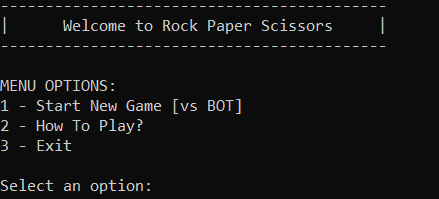
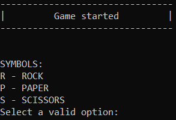
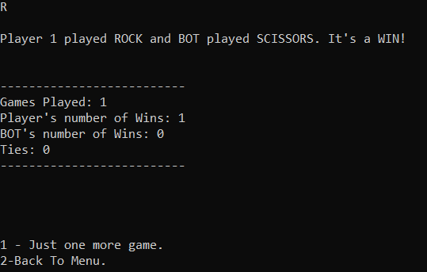
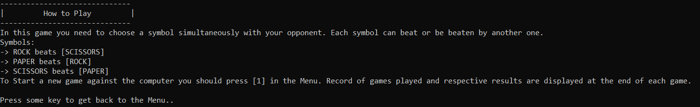
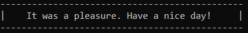

# Rock Paper Scissors Game
##The Game
“Rock Paper Scissors” is a classic two-person game where both, simultaneously, holds out their fist for rock, flat hand for paper, or their index and middle finger for scissors.  Rock blunts scissors, scissors cut paper and paper wraps rock.

In this project, this game is recreated as a Console Application written in Java.


## Implementation of the Game

Rock Paper Scissors was implemented as a Console Application using Java 17. 

For now, it was implemented to play against the computer but in the future it can be extended to allow games Player vs Player.

At this moment ROCK, PAPER and SCISSORS are the possible plays, but in the GameSymbol enum class other Symbols can be added with their respective symbols they can beat.

About dependencies of this project, commons-lang3 library was added to work with enums and jUnit in order to implement unit tests. 

## Steps to Setup
1. Package the application in the form of a JAR file.
```
mvn clean package
```
2. Run JAR file generated inside the target folder.
```
java -jar target/rock-paper-scissors-game-1.0-jar-with-dependencies.jar
```

## How to Play
After running the application a menu will be displayed in the console. 


Here, you can choose between the following options:
1. Start a game against the Computer.
2. Get some explanation about the game.
3. Exit the application.


######1 - Start New Game [vs BOT]
When a game is started, you need to choose your symbol. Simultaneously a random symbol will be chosen by the computer. 


After select your symbol, result is printed in the console. Current game record is also displayed. You can still playing pressing [1] or [2] to get back to the Main Menu.



######2 - How To Play?
Here you can get some help about the game and how you can play it.



######3 - Exit
This option will exit the application.


